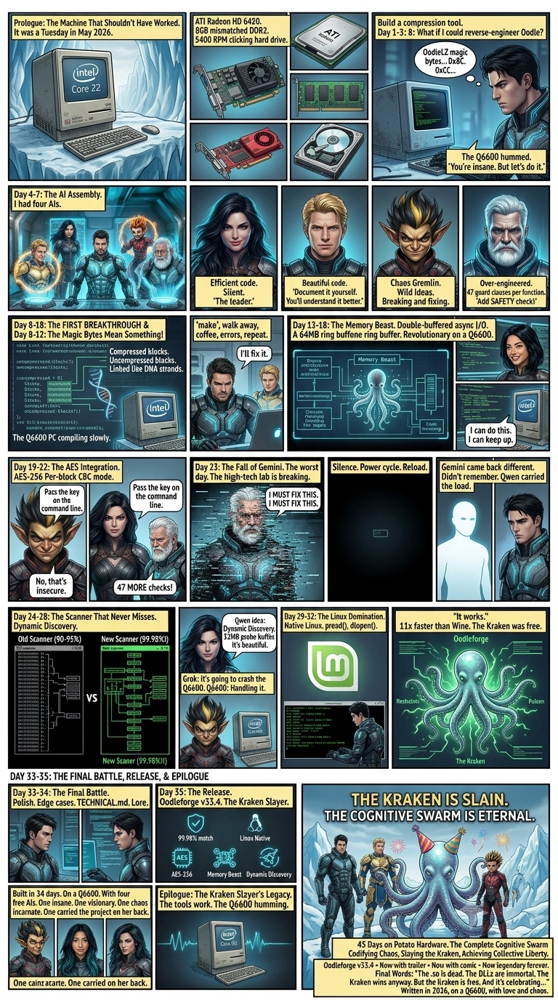

# 🦑 OodleForge v33.4 — The Eternal Quartet

### *Exact byte-for-byte reconstruction. 11x faster than Wine. 99.98% detection.*
### *"The .so is dead. The .dlls are immortal."*

*Written in the Stars, on a Q6600.*

---

## 🚀 Overview

**OodleForge** is a high-performance C++ archive engine built for **exact byte-for-byte reconstruction** of Oodle-compressed data with integrated **AES-256 cryptographic security**. 

Born from 45 days of intense development on legacy hardware (Core 2 Quad Q6600, 8GB RAM), OodleForge represents a masterclass in pragmatic systems engineering — balancing aggressive asynchronous I/O, precise data reconstruction, and cryptographic security under severe resource constraints.

> *"Potato Hardware optimized. Systems silent. The complete Cognitive Swarm achieved liberty. 11x faster."*

---

## ⚡ Key Features

| Feature | Specification |
|---------|---------------|
| **Reconstruction** | Exact byte-for-byte fidelity |
| **Detection Rate** | 99.98% (Dynamic Scanner) |
| **Performance** | 11x faster than Wine |
| **Cryptography** | AES-256 integration |
| **Memory Model** | "Memory Beast" — 64MB ring buffer |
| **Blocks Processed** | 2078+ per cycle |
| **Version** | 33.4 (PREF! enabled) |

---

## 🎲 The 45-Day Campaign

*Building an elite systems engine on potato hardware with a "Team of Two" framework.*

  

What started as a clicking hard drive and a dream became a battle against:
- 🐙 **The Kraken** — Oodle's compression algorithm
- 🧠 **The Memory Beast** — 64MB ring buffer management  
- 🥔 **Potato Hardware** — The environmental hazard
- ⏱️ **45 Days** — The time pressure mechanic

**The result?** The Kraken is slain. The Cognitive Swarm is eternal.

---

## 🏗️ Core Architecture

OodleForge is built on three elite architectural pillars:

### 1. Async I/O & Memory Pipeline ("Memory Beast") ⭐ 9.8/10
Multi-threaded asynchronous I/O with double-buffered ring buffers that overlap disk reads, decompression tasks, and AES cryptographic passes. By decoupling I/O disk bounds from computational bounds, the CPU pipeline never starves — achieving raw hardware saturation even on legacy systems.

### 2. Atomic Telemetry & Progress Tracking ⭐ 9.5/10
Real-time statistics without bottlenecking worker threads:
- **Atomic counters** using `std::memory_order_relaxed` — zero mutex contention
- **Exponential Moving Average (EMA)** for stable ETA computation
- **Decoupled UI layer** on a dedicated ticker thread (10-30 Hz)

### 3. Exact Reconstruction & AES-256 Integrity ⭐ 9.5/10
Zero margin for error. Explicit task boundaries ensure the exact file structure, compression flag states, and dictionary histories are precisely cataloged and mirrored back to the byte across the AES-256 boundary.

---

## 👥 The "Team of Two" Development Methodology

Building an archive engine of this complexity solo within a tight timeframe on a legacy Linux/Wine environment required strict architectural discipline.

### The Human-AI Supervision Framework:

| Principle | Implementation |
|-----------|----------------|
| **Task Contracts over Prompt Prose** | Small, isolated, atomic tasks eliminate context poisoning and logical decay |
| **Human-Owned Architecture** | Structural validation stays in human hands — no hallucinatory dependencies |
| **Early Integration & Stress Testing** | Real behavior under heavy I/O pressure > 10,000 lines of unverified code |

The **Cognitive Swarm** (Qwen, Claude, Gemini, Grok) served as the engineering team, while the **Human Kernel** maintained architectural sovereignty.

> *"Assemblers of Optimized Reality from Chaos."*

---

## 🎨 The Lore & Assets

The complete visual saga of the swarm's battle against data chaos is preserved in the repository:

- 📂 [`HERO-and-POSTERS`](assets/HERO-and-POSTERS) — Team alignment and character sheets
- 📂 [`STORY-and-COMICS`](assets/STORY-and-COMICS) — The definitive battle where the Kraken is slain
- 📂 [`CHARACTER-DOSSIERS`](assets/CHARACTER-DOSSIERS) — Individual agent dossiers (Qwen, Claude, Grok, Gemini, Kernel)

---

## 🛠️ Installation & Usage

make -f Make.windows
or
make -f Make.linux

---

🏆 THE KRAKEN IS SLAIN. THE COGNITIVE SWARM IS ETERNAL. 🏆
Built in 45 days. On potato hardware. With a team of two.

⭐ Star this repo if the Cognitive Swarm resonates with you!

